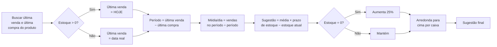
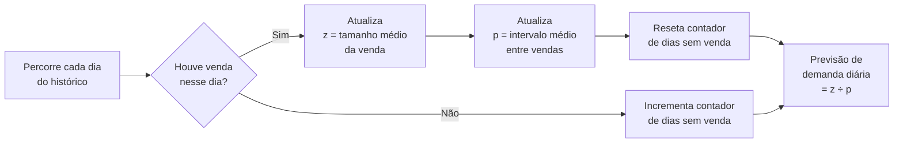
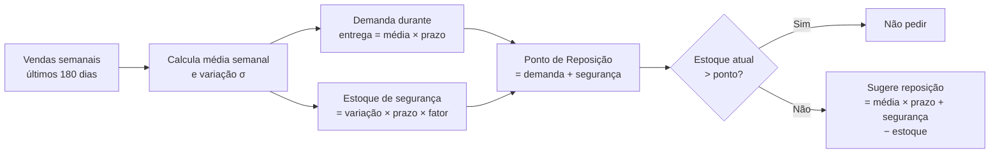
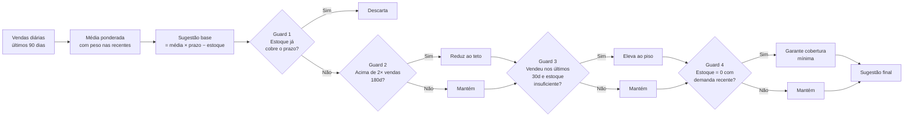
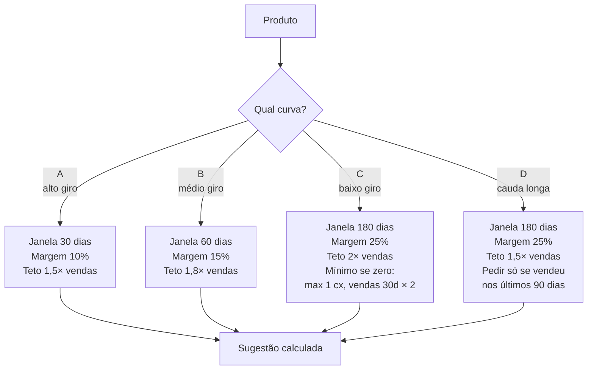
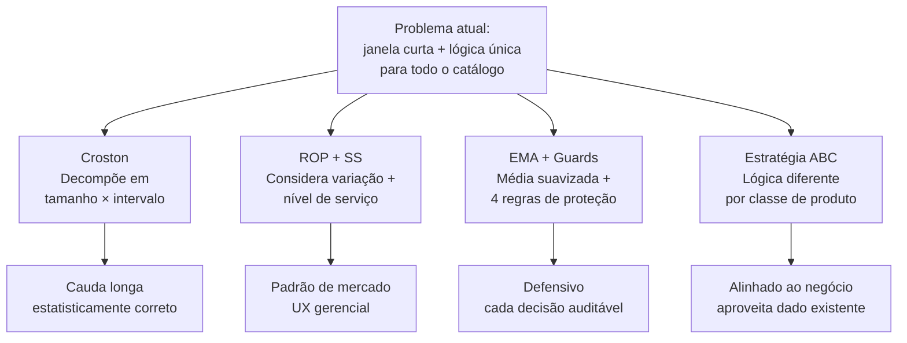

# Análise da Sugestão Automática de Pedido — Diagnóstico e Caminhos

> Documento de discussão técnica preparado a partir dos casos relatados pela Juliana (FORMULA NATURAL e MAGNUS, fornecedor Adimax).

---

## 1. O que motivou esta análise

Foram identificados **dois pedidos com sugestões que não fazem sentido prático**:

| Produto | Estoque | Vendas (180 dias) | Sugestão atual da Flow | O que a operação esperava |
|---|---|---|---|---|
| FORMULA NATURAL PRO CAES FILH MINI/PEQ 1kg | 4 unidades | 9 (≈ 1,5/mês) | **10 unidades** (2 caixas) | Comprar ~1 caixa (5) ou **não comprar** — estoque já cobre meses |
| MAGNUS T D SABOR CARNE 10,1KG | 0 unidades | 8 (≈ 1,3/mês) | **1 unidade** | Pelo menos **2–3 unidades** — vendeu 2 só em maio e zerou estoque |

A cliente percebeu que o algoritmo **superestima** num caso e **subestima** noutro. Investigamos o porquê e existem **quatro caminhos diferentes** para corrigir, com perfis distintos de complexidade e robustez. Este documento explica cada um e mostra como cada caminho trataria esses dois casos reais.

---

## 2. Como o cálculo funciona hoje

### O problema: a "janela curta"

A média por dia é calculada **só no período entre a última compra e a última venda** — que normalmente é uma janela de **5 a 30 dias**.

Para produtos de **alto giro** (ração popular Golden, areia higiênica) isso até funciona, porque sempre há vendas suficientes nessa janela.

Para produtos de **baixo giro** (que vendem 1–2× por mês), essa janela é instável: **uma única venda a mais ou a menos muda completamente o resultado**.

### Aplicando aos casos da Juliana

**FORMULA NATURAL** (vende ≈ 1,5/mês):
- Última compra: 15/05 · Última venda: ajustada para hoje 25/05 → janela de **11 dias**
- 2 vendas nessa janela ÷ 11 dias = **0,18/dia**
- 0,18 × 48 dias − 4 estoque = 4,7 → arredonda para **5 unidades (1 caixa)**
- **Mas a média real (180 dias) é 0,05/dia**, ou seja, **a janela curta inflou em ~4×**
- Estoque atual (4) já cobre ≈ 80 dias de demanda real → **deveria descartar**

**MAGNUS** (vende ≈ 1,3/mês):
- Estoque 0, última venda real (sem ajuste) e janela menor ainda → média 0,05/dia
- 0,05 × 48 × 1,25 − 0 = 3 unidades, mas no print da Juliana saiu **1 unidade**
- O algoritmo não tem regra explícita de cobertura para estoque zerado — só "1 caixa mínima"
- **Resultado:** subestima e deixa a loja a zero de novo no próximo cliente

### Resumo dos problemas estruturais

| # | Problema |
|---|---|
| 1 | Janela "última compra → última venda" é curta e instável para baixo giro |
| 2 | Trata produto popular e produto de nicho com a **mesma fórmula** |
| 3 | Não considera o quanto a demanda **varia** — só a média |
| 4 | Margem de 25% só liga quando estoque = 0 (binário, sem nuance) |
| 5 | Não tem **teto** — se a janela inflar, a sugestão dispara |
| 6 | Não tem regra explícita de **descartar** quando o estoque já cobre o período |

Os quatro caminhos a seguir atacam esses problemas com filosofias diferentes.

---

## 3. Caminho 1 — Croston (forecast para demanda intermitente)

### Conceito em uma frase

> Em vez de calcular "vendas por dia", **decompõe a demanda em dois números** que se atualizam toda vez que uma venda acontece: o tamanho médio da venda e o intervalo médio entre vendas.

É o algoritmo padrão da indústria farmacêutica e de peças de reposição — produtos com perfil parecido com pet shop de cauda longa (vendas esporádicas, muitos dias sem venda).

### Como funciona

As atualizações de `z` e `p` usam uma média ponderada que dá mais peso aos eventos recentes (mas sem deixar 1 venda dominar). É um modelo contínuo, sem precisar escolher uma janela.

### O que resolve

| Problema atual | Como Croston resolve |
|---|---|
| Janela curta instável | **Elimina** — não usa janela, atualiza só quando vende |
| Trata cauda longa diferente | **Sim, é o objetivo do algoritmo** — projetado para esse perfil |
| Sazonalidade | Não captura (limitação) |
| Variabilidade explícita | Parcial — z guarda variação do tamanho |
| Teto contra absurdos | Não tem por padrão (precisa adicionar) |

### Aplicando aos casos da Juliana

**FORMULA NATURAL:** o produto vende ≈ 1 unidade a cada ≈ 20 dias.
- `z = 1,0` · `p = 20` · forecast = 0,047/dia
- Demanda em 48 dias = 2,3 unidades — menor que o estoque atual (4) → **descarta** ✅

**MAGNUS:** o produto vende ≈ 1 unidade a cada ≈ 22 dias.
- `z = 1,0` · `p = 22` · forecast = 0,045/dia
- Demanda em 48 dias = 2,1 × margem de 25% (estoque 0) = **3 unidades** ✅

### Custo

- Algoritmo mais opaco para explicar ao usuário ("por que sugeriu 3?" exige falar de z e p).
- Precisa de pelo menos 3 vendas no histórico para começar a funcionar.
- Não captura sazonalidade (Natal, Black Friday).
- Implementação direta usando biblioteca pronta (statsforecast).

---

## 4. Caminho 2 — Ponto de Reposição + Estoque de Segurança

### Conceito em uma frase

> Calcula **dois números separados**: o quanto vou vender até o fornecedor entregar, e **quanto buffer eu preciso** para não furar estoque quando a demanda oscilar.

É o padrão de livro-texto da área de logística e supply chain, usado em SAP, Oracle e ERPs de grande porte.

### Como funciona

O grande diferencial é o **estoque de segurança dinâmico**: produto que vende sempre 2 unidades por semana tem variação baixa → buffer pequeno. Produto que vende 0-0-8-0 (variação alta) → buffer grande, para não rasgar estoque quando o pico chega.

Outro diferencial: o **nível de serviço** é uma escolha explícita — 90% / 95% / 99% de chance de não faltar produto. Cada classe pode ter um nível diferente.

### O que resolve

| Problema atual | Como ROP+SS resolve |
|---|---|
| Janela curta instável | **Resolve** — janela fixa de 180 dias |
| Trata cauda longa diferente | **Parcial** — variação σ inflada precisa de teto |
| Variabilidade explícita | **Sim, é a essência do método** |
| Nível de risco configurável | **Sim, é o diferencial gerencial** |
| Lojista escolhe risco | **Sim** — A/B/C com 99/95/90% por exemplo |

### Aplicando aos casos da Juliana

Assumindo nível de serviço **90%** para classe C (z = 1,28):

**FORMULA NATURAL:** vendas 9/180d → média 0,05/dia. Variação semanal estimada: σ ≈ 0,74 un/sem.
- Demanda durante entrega (7d) = 0,35
- Estoque de segurança = 0,95
- Ponto de reposição = 1,3 → estoque atual (4) já está acima → **não pedir** ✅
- Quantidade calculada = -0,7 → **descarta** ✅

**MAGNUS:** vendas 8/180d → média 0,044/dia. σ ≈ 0,68 un/sem.
- Demanda durante entrega = 0,31
- Estoque de segurança = 0,87
- Sugestão = 0,044 × 48 + 0,87 = 2,98 → **3 unidades** ✅

### Custo

- Demanda intermitente tem variação alta por natureza → buffer pode ficar inchado para produto que vende 1× ao mês.
- Pode precisar de teto para evitar exageros.
- Conceito mais "técnico" para o lojista, mas o **nível de serviço** é fácil de explicar e oferece um controle gerencial poderoso.

---

## 5. Caminho 3 — Suavização Exponencial + Guards de Segurança

### Conceito em uma frase

> Calcula uma **média que reage gradualmente** às vendas recentes (sem deixar 1 venda dominar) e aplica **quatro regras de proteção** que impedem sugestões absurdas para cima ou para baixo.

É a abordagem mais **pragmática e defensiva**: mesmo se a média errar, as regras de proteção (chamadas "guards") capam o resultado dentro de uma faixa razoável.

### Como funciona

### Os 4 guards explicados

| Guard | O que faz | Resolve qual problema |
|---|---|---|
| **1. Descarte por cobertura** | Se o estoque atual já cobre o prazo + entrega, sugere 0 | Caso FORMULA NATURAL — sugeria 10, vai sugerir 0 |
| **2. Teto superior** | Nunca sugere mais que 2× as vendas dos últimos 180 dias | Impede "vendi 9 no ano, sugere 20" |
| **3. Piso por demanda recente** | Se vendeu nos últimos 30d e estoque é baixo, garante reposição mínima | Evita sugerir 1 quando há demanda ativa |
| **4. Piso para estoque zerado** | Se zerei e tem qualquer demanda, mínimo = max(1 caixa, vendas_30d × fator) | Caso MAGNUS — força ≥ 2-3 unidades |

### O que resolve

| Problema atual | Como EMA+Guards resolve |
|---|---|
| Janela curta instável | Suavização contínua + guards |
| Teto contra absurdos | **Sim, é regra explícita (Guard 2)** |
| Regra explícita de descarte | **Sim (Guard 1)** |
| Estoque zerado com demanda | **Sim, regra dedicada (Guard 4)** |
| Variabilidade explícita | Indireta (via guards) |
| Explicável ao lojista | **Excelente** — cada número tem uma regra clara |

### Aplicando aos casos da Juliana

**FORMULA NATURAL:** estoque 4, média 30d ≈ 0,067.
- Cobertura atual = 4 ÷ 0,067 = 60 dias > prazo necessário → **Guard 1 dispara → descarta** ✅

**MAGNUS:** estoque 0, vendas 30d = 1, vendas 180d = 8.
- Sugestão base ≈ 3 unidades
- Guard 2 (teto): 8 × 48 ÷ 180 × 2 = 4,3 → não restringe
- Guard 4 (piso zero): max(1 caixa, 1 × 3) = 3 → garante **3 unidades** ✅

### Custo

- Os parâmetros (peso da média, fator de cobertura) são empíricos — precisa calibrar olhando dados reais.
- Sem fundamentação estatística forte — é "boas práticas + bom senso".
- **Maior vantagem:** cada decisão tem uma regra escrita por trás, fácil de auditar e ajustar.

---

## 6. Caminho 4 — Estratégia diferenciada por Curva ABC

### Conceito em uma frase

> O catálogo da loja tem **dois mundos diferentes** (giro alto vs cauda longa). Em vez de uma fórmula única, **uma estratégia diferente para cada classe** (A, B, C, D), aproveitando a classificação que **já existe** no banco de dados.

### Como funciona

### Por que essa segmentação faz sentido

O catálogo da Duubpets tem distribuição:

| Curva | Quantidade de produtos | % | Característica |
|---|---|---|---|
| A | 1.367 | 8% | Vendem todo dia — ração popular, areia |
| B | 1.026 | 6% | Vendem semanalmente |
| C | 4.433 | 25% | Vendem mensalmente — produtos especializados |
| D | 11.107 | 62% | Cauda longa — vendem trimestral ou menos |

**Tratar todos igual é o que causa o problema atual.** Ração Golden 15kg precisa de uma lógica; suplemento veterinário Magnus precisa de outra completamente diferente.

### O que resolve

| Problema atual | Como ABC resolve |
|---|---|
| Janela curta instável | **Sim, janela apropriada por classe** |
| Trata cauda longa diferente | **Sim, é o ponto central** |
| Teto contra absurdos | **Sim, cap por classe** |
| Regra explícita de descarte | **Sim, por classe** |
| Aproveita dado existente | **Sim — curva já está no banco** |
| Explicável ao lojista | **Excelente** — "é classe C, mínimo 2 caixas" |

### Aplicando aos casos da Juliana

Ambos são curva C (vendem mensalmente):

**FORMULA NATURAL** (estoque 4, vendas 180d = 9):
- Média = 9 ÷ 180 = 0,05/dia
- Sugestão base = 0,05 × 48 × 1,25 (margem) − 4 = **−1,4 → descarta** ✅

**MAGNUS** (estoque 0, vendas 30d = 1, 180d = 8):
- Média = 8 ÷ 180 = 0,044/dia
- Sugestão base = 0,044 × 48 × 1,25 = 2,6
- Mínimo (curva C, estoque 0) = max(1, vendas_30d × 2) = max(1, 2) = 2
- Final = max(2,6, 2) arredondado para caixa de 1 = **3 unidades** ✅

### Custo

- Depende de a classificação ABC estar atualizada. Hoje está populada via Bling, com 62% em D — então essa classe vai dominar o catálogo, precisa de boa calibração dos parâmetros dela.
- 16 parâmetros para definir (4 classes × 4 valores) — precisa calibração com a cliente.
- Quando um produto migra de classe (entra em promoção, vira sazonal), pode ficar dimensionado errado por um tempo.

---

## 7. Comparação geral dos 4 caminhos

### Tabela final

| Critério | Croston | ROP + SS | EMA + Guards | Estratégia ABC |
|---|---|---|---|---|
| Resolve janela curta | ✅ | ✅ | ✅ | ✅ |
| Trata cauda longa diferente | ✅ | parcial | parcial | ✅ |
| Considera variabilidade da demanda | parcial | ✅ | indireta | indireta |
| Nível de risco configurável | não | **✅ explícito** | não | parcial |
| Teto contra absurdos | precisa adicionar | precisa adicionar | ✅ | ✅ |
| Regra explícita de descarte | precisa adicionar | ✅ | ✅ | ✅ |
| Aproveita dado já existente | não | não | não | **✅ (curva ABC)** |
| Explicável para a operação | médio | bom | **excelente** | **excelente** |
| Custo de implementação | médio | médio | baixo | baixo |
| Pega sazonalidade | não | parcial | parcial | parcial |

### Resultado nos dois casos da Juliana

| Caso | Croston | ROP+SS | EMA+Guards | ABC |
|---|---|---|---|---|
| **FORMULA NATURAL** (esperado: descartar) | descarta ✅ | descarta ✅ | descarta ✅ | descarta ✅ |
| **MAGNUS** (esperado: 2–3) | 3 ✅ | 3 ✅ | 3 ✅ | 3 ✅ |

> Todos os quatro caminhos chegam no resultado certo. A diferença está em **como** chegam, **o que custa implementar**, e **o quão fácil é explicar** para a operação.

---

## 8. Combinações possíveis (opcional)

Os caminhos não são mutuamente exclusivos. Duas combinações fazem muito sentido:

### A. EMA + Guards segmentado por ABC

> Aplica a lógica do Caminho 3, mas com **parâmetros diferentes por classe** (vindo do Caminho 4). O peso da média e os fatores de cobertura mudam conforme a curva do produto.

**Vantagem:** junta o melhor dos dois — a robustez dos guards e o alinhamento com o negócio. É a opção que tem **maior probabilidade de funcionar bem** sem virar over-engineering.

### B. Croston só para C/D + lógica simples para A/B

> Usa Croston apenas onde ele brilha (cauda longa, vendas esporádicas) e mantém regra simples para commodities de giro alto.

**Vantagem:** rigor técnico onde precisa, simplicidade onde dá pra ser simples.

---

## 9. Próximo passo

Definir a direção a seguir e detalhar especificação + plano de implementação. Sugestão de critérios para a decisão:

1. **Quanto a operação precisa entender o "porquê" da sugestão?**
   Se for muito importante a Juliana saber explicar cada número — favorece **EMA+Guards** ou **ABC**.

2. **A operação quer um botão de "risco" explícito?**
   Se quer poder dizer "neste fornecedor eu aceito risco maior, no outro não" — favorece **ROP+SS**.

3. **Quanto vale o investimento em algoritmo "de referência"?**
   Se for prioridade ter um modelo defensável tecnicamente para produtos de baixo giro — favorece **Croston**.

4. **Velocidade de implementação e ajuste?**
   Se a prioridade é entregar logo e ir refinando com dados reais — favorece **EMA+Guards + ABC** (combinação A acima).

---

*Documento técnico de discussão. Após o alinhamento da direção, será gerada uma especificação detalhada com fórmulas, parâmetros calibráveis e plano de rollout (incluindo modo "shadow" para comparar lado-a-lado com o algoritmo atual antes da troca).*
